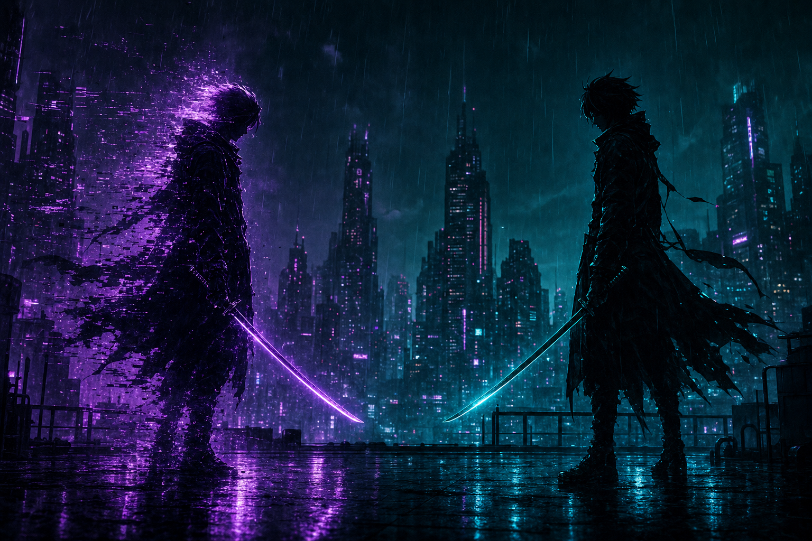
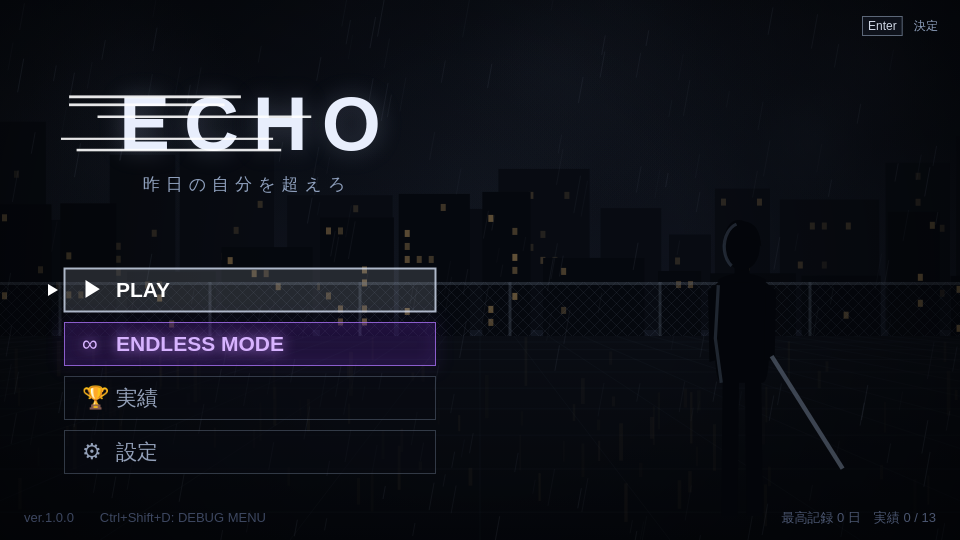
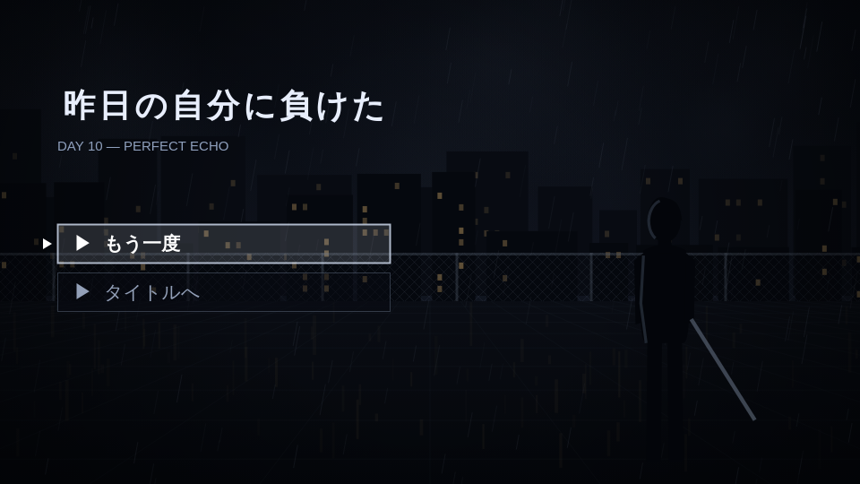
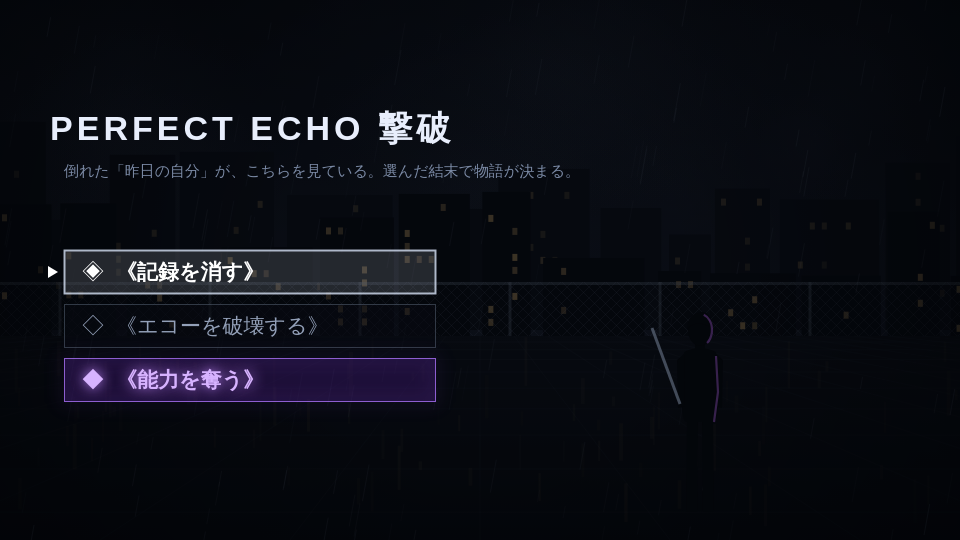
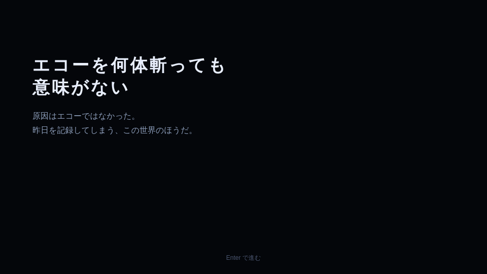

<p align="center">
  
</p>

<h1 align="center">ECHO — 昨日の自分を超えろ</h1>

<p align="center">
  <strong>「昨日の自分」と 1 対 1 で剣を交える、ブラウザ・アクションゲーム</strong>
</p>

<p align="center">
  依存関係なし / HTML5 Canvas + ES Modules / ローカルですぐ遊べる
</p>

---

## このゲームで何がすごいのか

敵は、**プレイヤー“昨日”の動きをまねる「エコー」**です。

普通の敵 AI とは違い、エコーは「どこに立っていたか」ではなく、**「そのときどう判断したか」**を記録・再現します。

- 射程外なら近づいてから斬る
- 逃げられたらコンボをやめて追いかける
- 同じ技を 2 回避けられると、3 回目はフェイントを混ぜてくる
- 3 割は記憶ではなく、今のプレイヤーへの反応で動く

つまり、**毎日「昨日の自分」を倒し続けないと、強くなりすぎた昨日に負ける**ループが生まれます。

---

## スクリーンショット

| タイトル | 戦闘（DAY 10 / PERFECT ECHO） |
|---|---|
|  |  |

| 撃破後の選択 | BAD END「エコーを破壊する」 |
|---|---|
|  |  |

---

## 開発者のこだわり

### 1. 「攻撃」をコピーするのではなく「判断」をコピーする

はじめは「攻撃ボタンを押したタイミング」をそのままコピーしていました。
すると、プレイヤーが動かずに倒せた 1 日目を、翌日のエコーが真似て「何もない方向を斬り続ける」バグが出ました。

そこで変えたのが、**「今の状況」に応じた「判断」をコピーする**方法です。
これにより、エコーは単なる録画ではなく、昨日と同じ“考え方”でプレイヤーに迫ってきます。

### 2. 紫色のノイズで「来るぞ」を伝える

エコーが昨日の行動を再現している間、体に**紫色のノイズ**が走ります。

光ったら、次に来るのは昨日の自分の手だ──という合図です。
この演出で、プレイヤーは「敵の行動が読めない」ではなく、「敵の行動が読める」爽快感を得られます。

### 3. 「昨日こうしたから今日こう」が自然になる攻撃感覚

反射神経よりも「昨日の自分をどれだけ覚えているか」で勝てるように、テンポを微調整しました。

- 斬撃は**プレイヤーもエコーも 0.4 秒の予備動作**
- 連撃は **3 撃まで**
- 能力は**紫の輪＋音で 0.35 秒予告**してから発動
- 移動・攻撃・能力は同時に出せず、行動の間には 0.16 秒の猶予

自分と全く同じルールで戦う相手だからこそ、**読み合いが成立する**速度に設計しています。

### 4. 依存関係ゼロ、サクッと動く構成

- HTML5 Canvas + 生の ES Modules
- ビルド・バンドル不要
- `python3 -m http.server 8000` だけで起動
- 進行状況・実績・設定は **Supabase (Postgres)** に永続化（接続不可時は `localStorage` フォールバック）

---

## ストーリー

DAY 1 から DAY 10 まで、毎日「昨日の自分」と戦います。

- DAY 1 だけは「昨日」がいないので、**ZERO ECHO** が相手
- DAY 10 は 5 能力すべてを持つ **PERFECT ECHO**
- PERFECT ECHO は、DAY 1〜9 でプレイヤーがどの能力を使ってきたかをそのまま受け継ぎます

PERFECT ECHO を倒すと、**《記録を消す》/《エコーを破壊する》/《能力を奪う》** の 3 択が出現。
選択肢には結末が書かれていないので、選んでから分かります。

| 選択 | 結末 |
| --- | --- |
| 《記録を消す》 | 記録も能力もすべて消える。コピーされる「昨日」が無くなり、時間が 0:00:00 → 0:00:01 と進んでループ終了（TRUE END） |
| 《エコーを破壊する》 | 砕けた向こうに立っているのは自分自身。原因は世界のほうだと分かり、DAY 12 でループが続く（BAD END） |
| 《能力を奪う》 | タイトルに戻る瞬間にノイズが走る |

どれを選んでも `ENDLESS MODE`（紫に発光）と `実績` が出現します。

---

## 遊び方

```bash
python3 -m http.server 8000
# http://localhost:8000 を開く
```

`file://` では ES Modules が動かないので、必ずローカルサーバー経由で開いてください。

## 操作

| キー | 動作 |
| --- | --- |
| ← → | 移動 |
| J / Space | 斬撃 |
| K | パリィ |
| 1〜5 | 能力 |
| Enter | 決定 |
| Esc | 戻る・リタイア |

## 能力

最初は能力なし。エコーを 1 体倒すごとに 1 つ解放されます。

| 能力 | 効果 |
| --- | --- |
| 瞬歩 | 前方へ高速移動、移動中無敵。相手を追い越したら自動で振り向く |
| 反射 | 一定時間、受けたダメージを相手に返す |
| 時止め | 相手の動きを一定時間止める |
| 残像 | 身代わりを出し、次の被弾を 1 回無効化 |
| 炎刃 | 次の 3 回の斬撃に追加ダメージ |

## 実績（全 13 / エンドレスモード専用）

| 実績名 | 条件 |
| --- | --- |
| 十日を超えた者 | 10 日間生き残る |
| 一か月前の俺 | 30 日間生き残る |
| 半世紀の昨日 | 50 日間生き残る |
| 昨日っていつだ？ | 100 日間生き残る |
| 無傷の今日 | エコーをノーダメージで倒す |
| 能力なんていらない | 能力を一度も使わずにエコーを倒す |
| それ、知ってる | エコーの攻撃を 5 回連続でパリィする |
| 昨日の癖 | エコーの《瞬歩》攻撃を 3 回連続で回避する |
| 全部返す | 《反射》によるダメージでとどめを刺す |
| 1秒あれば十分 | 《時止め》発動中にエコーを倒す |
| 残像対残像 | エコーとほぼ同時に《残像》を発動する |
| 炎の昨日 | 《炎刃》による攻撃でとどめを刺す |
| もう一人の達人 | 5 つの能力すべてを使ったエコーを倒す |

---

## セーブ・永続化

進行状況・実績・設定は **Supabase (Postgres)** に保存されます。
接続できない場合のみ `localStorage`（キー `echo.save.v1`）にフォールバックします。

設定画面からセーブデータを削除できます。

---

## 開発者メッセージ

> 11 歳です。毎日「昨日の自分」と戦って強くなる、というループにハマって作りました。  
> 一番難しかったのは、エコーが「昨日の動き」をそのまま真似るだけだと空を斬るだけだったので、**「判断」をコピーする**ロジックに切り替えたことです。  
> その上で、プレイヤーが「読める」くらいの速度に調整し、**紫色のノイズ**で「昨日が来る」ことを直感的に伝えています。

---

## 審査基準（AiAU Craft Day）

本プロジェクトは [AiAU Craft Day](https://aiau.connpass.com/event/401500/)（Supabase × Devin）に向けて制作しています。

最終日のデモ発表は Google Form へ Project title / description / 任意の添付ファイル / GitHub URL 等を提出し、事前審査を経て選抜された 10 チームが最終発表に進みます。審査は 100 点満点で、以下の観点から行われます。

| 審査項目 | 評価のポイント | 配点 |
| --- | --- | --- |
| スポンサーツール活用度 | Supabase・Devin を効果的に使えているか | 25 |
| 完成度 / 動作 | プロトタイプが実際に動作し、体験として成立しているか | 25 |
| アイデア / 独自性 | 発想の新しさ・着眼点のユニークさ | 20 |
| 課題解決 / インパクト | 誰のどんな課題を解決し、どれだけ価値があるか | 15 |
| プレゼンテーション | デモと説明が分かりやすく伝わるか | 15 |

### 表彰

- 最優秀賞
- Supabase賞
- Cognition賞
- オーディエンス賞

---

## 今後の展望

- エンドレスモードのスコアランキング
- オンライン対戦（プレイヤー同士のエコーを交換）
- スマートフォン対応のタッチ操作
- より深いエコー学習（プレイヤーの癖を更多角的に再現）

---

## ライセンス

MIT License
